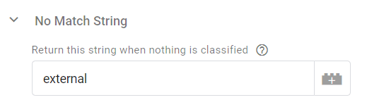

# Traffic Type Classifier

## What is the Traffic Type Classifier?
The Traffic Type Classifier is a Custom Template for GTM server-side which labels and filters your events by searching event parameters in the event payload using particular search criteria.  Multiple classification rules can be setup run in order of priority. Once a match for your traffic is found, a classification string is returned. If no match is found, a default string is returned. This can be used to populate the `traffic_type` event parameter in GA4 filtering, or as a filter condition in GTM server-side triggers.

The Traffic Type Classifier has 5 different types:

1.  **Default Bots**  - Search the  `user_agent`  for a preset list of known bots (inspired by  [Simple Bot Detector](https://github.com/mbaersch/simple-bot-detector)).
2.  **Custom Bots**  - Search the  `user_agent`  for a custom list of bots.
3.  **IP Addresses**  - Search the IP Address  `ip_override` for certain IP Addresses.
4.  **Page Locations**  - Search the Request URI  `page_location`  for certain URLs or partial matches of URLs.
5.  **Custom Event Parameters**  - Search any event parameter in the event payload.

## Why use the Traffic Type Classifier?
In GA4 Properties, you can only filter traffic based on IP address, and not by other fields in the HTTP request header, or custom dimensions. The Traffic Type Classifier restores this functionality, and has an interface reminiscent of Universal Analytics filters. This has the following advantages:

 - Filter traffic into different GA4 properties based off more than just IP address.
 - Consistently apply the same filtering across all your server-side Martech tags, not just GA.
 - Use a dedicated GTM variable for `OR` logic filtering, which is more suitable for filtering traffic than GTM Trigger `AND` logic.

## Using the Traffic Type Classifier
Log into GTM server-side, and select **Templates** > **Variable Templates** > **Search Gallery**

After adding the **Traffic Type Classifier** from Google's [Community Template Gallery](https://tagmanager.google.com/gallery/#/variables?context=server&page=1), navigate to your server-side **Variables** and click **New** under User-Defined Variables. Choose **Custom Templates** > **Traffic Type Classifier**.

### Enabling a Classifier
Checking the "Enable Classifier" checkbox will enable all classification rules for that type. Unchecking means that no rules for this type will run.

### Adding a new Classification
The below example shows how to add a new classification for the *Custom Bot* classifier, but the interface is the same for all other classifiers (except for *Default Bots*).

Start by clicking **Add Row**:

 1. Now, enter a **Name** for the classification. For *Custom Bots*, *IP Addresses* and *Page Locations*, this is just a friendly name used to identify the classification, while for *Custom Event Parameters*, this must be the exact parameter name, typically in `snake_case` for example: `page_title`.
 2. Choose a **Match Type** from the drop-down menu. Options include, equals, contains, starts with, ends with, regex, does not equal, does not contain, does not start with, does not end with, and, does not match regex.
 3. Enter a **Search** string. Note, regex options must be in a regular expression format.
 4. Choose whether the search string is **Case Sensitive** or not. Default is not case sensitive.
 5. Choose a **Classify As** classification string. This is the string returned by the GTM variable if a match was found.
 6. One done hit **Add**.
   
 

You should now see the following row added to the table:

Don't forget to add a **No match String**. This is the classification string returned when there are no matches to any rules. This can be used in GA4 reporting.

## Using The Classification Variable
Once you've created your server-side variable, you can now use it in a number of ways. The two most common use cases are to populate the GA4 [`traffic_type`](https://support.google.com/analytics/answer/10108813?hl=en) parameter, and to use it as condition or several conditions in a server-side trigger.

### Use Case 1: GA4 Traffic Type Parameter
Use the Traffic Type Classifier to populate the `traffic_type` parameter and send this to GA4.

This can then be used as a filter condition in GA4. To do this, log into GA4, click **Admin** > **Data Settings** > **Data Filters** > **Create Filter**. Using the Acme Bots example, you could configure the GA4 filter as follows:

### Use Case 2: Trigger Condition
This example how the same Traffic Type Classifier can also be used as a filter condition. In example we're only allowing "external" traffic to filter into the GA4 production account. External is the string returned when there's been no classification matches

